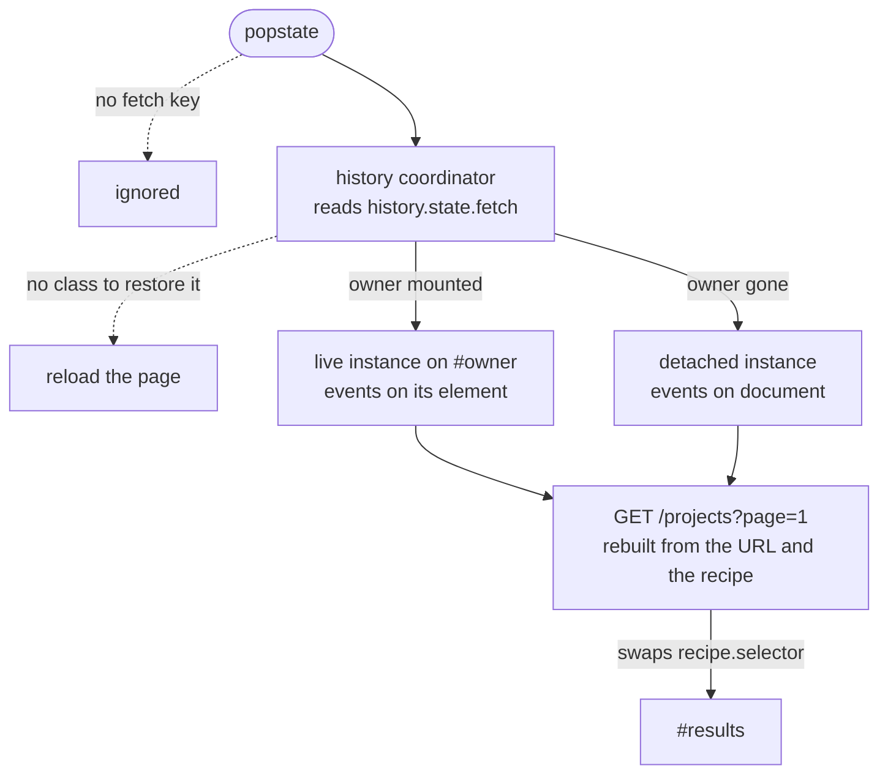

# Fetch <Badges :texts="$frontmatter.badges" />

The `Fetch` component adds AJAX capabilities to your existing HTML, with support for the [View Transition API](https://developer.mozilla.org/en-US/docs/Web/API/View_Transition_API) to transition between states.

## Usage

The `Fetch` component can be used to perform GET or POST requests without reloading the page.

```js twoslash
import { registerComponents } from '@studiometa/js-toolkit';
import { Fetch } from '@studiometa/ui';

registerComponents(Fetch);
```

### Basic

Given the following HTML:

```html
<a data-component="Fetch" href="/some-content">Click me</a>

<div id="content"></div>
```

And the following response from the `/some-content` endpoint:

<!-- prettier-ignore-start -->
```html
<div id="content">
  Lorem ipsum dolor sit amet, consectetur adipisicing elit.
</div>

Some extra content.
```
<!-- prettier-ignore-end -->

Clicking on the link will dispatch a background fetch request and will replace the `<div id="content"></div>` element with the new content from the fetch response. The page will have the following HTML after:

<!-- prettier-ignore-start -->
```html
<a data-component="Fetch" href="/some-content">Click me</a>

<div id="content">
  Lorem ipsum dolor sit amet, consectetur adipisicing elit. <!-- [!code ++] -->
</div>
```
<!-- prettier-ignore-end -->

::: warning 💡 Important
We use `id` attributes to detect which content from the response should be used and injected in the DOM. Any content from the response not nested in a parent with an `id` attribute will be discarded.
:::

A click with a modifier key, a middle click and a link with a `target` other than `_self` are left to the browser. A link without a `target` of its own takes the `target` of the `<base>` element, as natively.

### From any element

The `Fetch` component is not limited to `<a>` and `<form>` elements. On any other element, set the [`src` option](./js-api.md#src) to the endpoint to request, and call the [`fetch()` method](./js-api.md#fetch-destination-string-url), for example from an event through the [`Action`](../Action/index.md) component.

::: code-group

```html [index.html]
<div data-component="Action Fetch" data-option-src="/some-content" data-on:click="Fetch.fetch()">
  Click me
</div>

<div id="content"></div>
```

```js twoslash [app.ts]
import { registerComponents } from '@studiometa/js-toolkit';
import { Action, Fetch } from '@studiometa/ui';

registerComponents(Action, Fetch);
```

:::

Such an element has no destination of its own: `fetch()` requests `src`, with the [`params` option](./js-api.md#params), and writes no history. Give `fetch()` a destination, such as `Fetch.fetch('/other-content')`, to request a page and write it to history.

### Back and forward navigation

Set the [`history` option](./js-api.md#history) to write the destination of each request to the browser history. Back and forward navigation then restore the content of each entry.

```html
<a href="/projects?page=2" id="pager" data-component="Fetch" data-option-history>2</a>
```

<llm-exclude>
<FetchHistoryCoordinator />
</llm-exclude>
<llm-only>



</llm-only>

- **One owner per page.** One history coordinator holds the only `popstate` listener of the page. Two `Fetch` elements with `history` never race on one back navigation: it sends one request.
- **The entry keeps a recipe.** Each entry stores plain data under the `fetch` key of `history.state`: the regions to swap, the swap mode, the [`params`](./js-api.md#params) and [`src`](./js-api.md#src) options, and the `id` of the element that wrote it. Back rebuilds the request from the restored URL and that recipe. It works after the element has left the page. See [history entries](./js-api.md#history-entries).
- **Push by default.** Each request adds an entry, as a native navigation does. Set [`historyMode`](./js-api.md#historymode) to `replace` for a live search: the request replaces the current entry, so back leaves the search instead of going back one keystroke.
- **Entries of other scripts are kept.** An entry without a `fetch` key is ignored, and the keys that other scripts put in `history.state` are kept.
- **A POST writes history only after a redirect.** The entry is then the page the server redirected to, which back restores with a GET. A POST without a redirect writes nothing.
- **Give the element an `id`.** The events of a restore reach the element that wrote the entry only when it has an `id`. Without one, they reach `document`.

### A lighter page: `params` or `src`

The address bar always shows the destination: the `href` of a link or the `action` of a form. The URL that is requested is derived from it, so back and forward navigation can rebuild it from the restored URL alone. Two options change it:

- [`params`](./js-api.md#params) adds query parameters to the page itself. Use it to request a lighter copy of the same page: pagination, Shopify sections, a `view=fragment` template.
- [`src`](./js-api.md#src) is a fixed endpoint. It gives the origin and the path, and the query of the destination is folded on. Use it for another endpoint, such as a live search that requests a search service.

<llm-exclude>
<FetchUrlDerivation />
</llm-exclude>
<llm-only>

1. Origin and path: from `src` when it is set, otherwise from the destination.
2. Query: the query of `src`, then the query of the destination folded on. Without `src`, the query of the destination.
3. `params` are set last, so they win.

| Option       | Markup                                                                 | Navigate                                               | Back                                                   |
| ------------ | ---------------------------------------------------------------------- | ------------------------------------------------------ | ------------------------------------------------------ |
| `params`     | `<a href="/projects?page=2" data-option-params='{"view":"fragment"}'>` | `/projects?page=2` → `/projects?page=2&view=fragment`  | `/projects?page=1` → `/projects?page=1&view=fragment`  |
| `src`        | `<form action="/help" data-option-src="/apps/search?view=fragment">`   | `/help?q=shoes` → `/apps/search?view=fragment&q=shoes` | `/help?q=boots` → `/apps/search?view=fragment&q=boots` |
| `formaction` | `<button formaction="/elsewhere">` in a form with `src` and `params`   | `/elsewhere?q=hello` → `/elsewhere?q=hello`            |                                                        |

</llm-only>

Keep a lighter copy of the page out of `src`: `src` is the same for every page, so back to page 1 would request the copy of page 2. Use `params` instead.

### Forms

A form submission sends what a native submission would send:

- **The submitter.** The body comes from `new FormData(form, submitter)`, so the name and the value of the button that submitted the form are sent.
- **Overrides.** A submitter with a `formaction`, `formmethod` or `formenctype` attribute overrides the form for that submission. `formaction` also wins over the [`src`](./js-api.md#src) and [`params`](./js-api.md#params) options, which do not apply to that submission. The parameters that a subclass adds for its transport, such as the `sections` of [`FetchShopifySection`](../FetchShopifySection/index.md), still apply.
- **GET.** The fields replace the query of the `action`, as natively.
- **POST.** The body is URL-encoded by default, as natively. A file control then sends only the name of its file, and the `fetch.file-not-uploaded` diagnostic is reported. Set `enctype="multipart/form-data"` to upload files. `enctype="text/plain"` sends `name=value` lines.
- **Left to the browser.** A `dialog` method closes its dialog natively, and a `target` or `formtarget` other than `_self` opens another browsing context. A form without a `target` of its own takes the `target` of the `<base>` element. `Fetch` does not intercept these submissions.
- **The Enter key.** Pressing <kbd>Enter</kbd> in a field submits the form through its first submit button, as natively. A form that paginates with submit buttons sends the value of the first one.

The submitter makes pagination with no script of its own:

```html
<form action="/projects" method="get" data-component="Fetch" data-option-history>
  <input type="hidden" name="orderby" value="title" />
  <button type="submit" name="page" value="1">1</button>
  <button type="submit" name="page" value="2">2</button>
</form>

<div id="projects">…</div>
```

The second button requests `/projects?orderby=title&page=2`, writes it to history and swaps `#projects`. See the [pagination example](./examples.md#pagination).

### With a loader

Use the [`Action`](../Action/index.md) and [`Transition`](../Transition/index.md) components to display a loader while the request runs. Every request ends with exactly one [`fetch-after` event](./js-api.md#fetch-after), after the DOM change, so a loader bound to `fetch-before` and `fetch-after` covers the whole navigation, aborts included.

::: code-group

```html [index.html]
<a
  href="/"
  data-component="Fetch Action"
  data-option-history
  data-on:fetch-before="Transition(#foo) -> target.enter()"
  data-on:fetch-after="Transition(#foo) -> target.leave()"
  data-on:fetch-error="alert('error')">
  Click me
</a>

<div
  data-component="Transition"
  data-option-enter-from="opacity-0"
  data-option-leave-to="opacity-0"
  class="opacity-0"
  id="foo">
  Loading...
</div>

<div id="content"></div>
```

```js twoslash [app.ts]
import { registerComponents } from '@studiometa/js-toolkit';
import { Action, Fetch, Transition } from '@studiometa/ui';

registerComponents(Action, Fetch, Transition);
```

:::

#### Global loader

The [events](./js-api.md#events) sent by the `Fetch` component bubble up the DOM tree. This means that the `Action` component can be placed on a parent of the element where the `Fetch` component is configured.

```html
<main
  data-component="Action"
  data-on:fetch-before="Transition(#fetch-loader) -> target.enter()"
  data-on:fetch-after="Transition(#fetch-loader) -> target.leave()">
  ... ...
  <a data-component="Fetch" href="/page/2">Next page</a>
  ... ...
</main>

<div
  data-component="Transition"
  data-option-enter-from="hidden"
  data-option-leave-to="hidden"
  data-option-leave-keep
  class="hidden"
  id="fetch-loader">
  Loading...
</div>
```

A new request on the same element ends the previous one first, so the loader stays on. Requests that write history run one at a time on the page. Other requests run one at a time per element only: two elements without `history` can run in parallel, and the first `fetch-after` would hide a shared loader. Count the requests in flight when several such elements share one loader.

### Transitions

The `Fetch` component is compatible with the [View Transition API](https://developer.mozilla.org/en-US/docs/Web/API/View_Transition_API) in compatible browsers. By default, the browser chooses which transition to use between the two states of the DOM. If you want more fine-grained transition, use the [View Transition CSS APIs](https://developer.mozilla.org/en-US/docs/Web/API/View_Transition_API#css_additions).

```css [app.css]
::view-transition-old(root) {
  animation: transition-out 1s ease-in-out;
}

::view-transition-new(root) {
  animation: transition-in 1s ease-in-out;
}

@keyframes transition-out {
  to {
    opacity: 0;
  }
}

@keyframes transition-in {
  from {
    opacity: 0;
  }
}
```

::: tip Disabling View Transitions
You can disable view transitions with the [`data-option-no-view-transition` attribute](./js-api.md#viewtransition).
:::

To run the change with your own choreography, register a runner on the [`js-toolkit:dom:update` event](./js-api.md#the-js-toolkit-dom-update-protocol-event).

### Error handling

The `Fetch` component catches request errors and emits a [`fetch-error` event](./js-api.md#fetch-error) which can be used to display meaningful information. A response with a status that is not ok, a response that cannot be parsed and an error thrown by the DOM change are errors too. An aborted request is not.

::: code-group

<!-- prettier-ignore-start -->
```html [index.html] {3}
<main
  data-component="Action"
  data-on:fetch-error="alert(event.detail.error)">
  <a href="/" data-component="Fetch">Home</a>
</main>
```
<!-- prettier-ignore-end -->

```js twoslash [app.ts]
import { registerComponents } from '@studiometa/js-toolkit';
import { Action, Fetch } from '@studiometa/ui';

registerComponents(Action, Fetch);
```

:::

See the [error handling example](./examples.md#error-handling) for detailed usage.

### Cancelling a request

The [`abort` method](./js-api.md#abort-reason-unknown) cancels the request in flight. It emits [`fetch-abort`](./js-api.md#fetch-abort), then `fetch-after` with the outcome `aborted`.

::: code-group

<!-- prettier-ignore-start -->
```html [index.html] {3,7-8}
<main
  data-component="Action"
  data-on:fetch-abort="alert('Request was aborted')">
  <a href="/" data-component="Fetch">Home</a>

  <button
    data-component="Action"
    data-on:click="Fetch -> target.abort()">
    Cancel request
  </button>
</main>
```
<!-- prettier-ignore-end -->

```js twoslash [app.ts]
import { registerComponents } from '@studiometa/js-toolkit';
import { Action, Fetch } from '@studiometa/ui';

registerComponents(Action, Fetch);
```

:::

See the [cancelling a request example](./examples.md#cancelling-a-request) for detailed usage.

### Handling JSON response

If you need to fetch an API whose content-type is `application/json`, you can use the [`data-option-response` option](./js-api.md#response) to extract the content that will be inserted in the DOM from the JSON object.

::: code-group

<!-- prettier-ignore-start -->
```html [index.html] {3-4}
<form
  action="/api/msg"
  data-component="Fetch"
  data-option-response="response.json().then((data) => data.rendered)">
  <input type="text" name="msg" value="Hello world!">
  <button type="submit">
    Submit
  </button>
</form>

<div id="content">...</div>
```
<!-- prettier-ignore-end -->

```json [/api/msg]
{
  "rendered": "<div id=\"content\">Hello world!</div>"
}
```

```ts [app.ts] twoslash
import { registerComponents } from '@studiometa/js-toolkit';
import { Fetch } from '@studiometa/ui';

registerComponents(Fetch);
```

:::

### Tracking a request

The `response` of the [`fetch-update-after` event](./js-api.md#fetch-update-after) is plain data with lower-case header names, so the [`Track`](../Track/index.md) component can read it from markup. See [tracking the result of a request](../Track/js-api.md#tracking-the-result-of-a-request).
