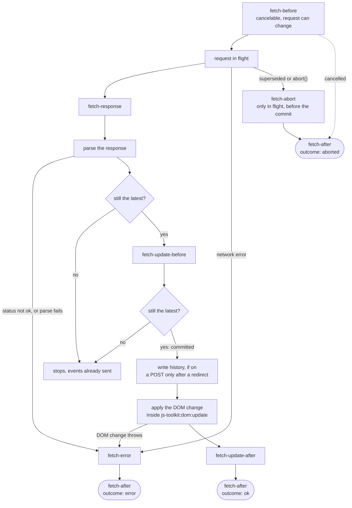

# JS API

## Options

### `history`

- Type: `boolean`
- Default: `false`

Writes the destination of each request to the browser history, and restores it on back and forward navigation. The destination is what the address bar shows: the `href` of a link, the `action` of a form with its fields, the `formaction` of the submitter, or a destination given to [`fetch()`](#fetch-destination-string-url).

- Only a request with a destination writes history. A `Fetch` on an element that is neither a link nor a form writes none, unless `fetch()` receives a destination.
- A GET writes its destination in full, with its own hash.
- Another method writes history only after a redirect. The entry is the URL the server redirected to, without the keys of the [`params` option](#params), and back restores it with a GET. A request to a [`src` endpoint](#src) that is not a GET writes no entry.
- A cross-origin URL is never written.
- When an entry is written or restored, the page takes the `<title>` of the response.

See [back and forward navigation](./index.md#back-and-forward-navigation) for how entries are restored.

### `historyMode`

- Type: `'push' | 'replace'`
- Default: `'push'`

How a request writes history.

- `push` adds an entry, as a native navigation does. Back returns to the previous state of the page.
- `replace` replaces the current entry. Back then leaves the page, not the last state of the request. Use it for a live search, where one entry per keystroke would make back useless.

Any other value reports the `fetch.invalid-history-mode` diagnostic, and `push` is used.

```html
<form
  action="/search"
  data-component="Fetch"
  data-option-history
  data-option-history-mode="replace">
  <input type="search" name="q" />
</form>
```

#### History entries

Each entry keeps a restore recipe under one key, `fetch`, of `history.state`. `Fetch` merges this key into the state, and it keeps every key that other scripts put there:

```ts
// history.state after a push or a replace
{ ...otherKeys, fetch: RestoreRecipe }

interface RestoreRecipe {
  component: string; // the config name of the class that wrote the entry
  owner?: string; // the id of the element that wrote the entry, if it has one
  selector: string;
  mode: SwapMode; // `append` and `prepend` are stored as `replace`
  params: Record<string, string>;
  src?: string; // the absolute endpoint
  response: string;
  headers: Record<string, string>;
  viewTransition: boolean;
  [option: string]: unknown; // the options a subclass adds, such as `partials`
}
```

<llm-exclude>
<FetchHistoryEntries />
</llm-exclude>
<llm-only>

| Entry             | URL                    | `history.state`                   | How                                                       |
| ----------------- | ---------------------- | --------------------------------- | --------------------------------------------------------- |
| 0, first load     | `/projects`            | `{ ...otherKeys, fetch: recipe }` | Stamped with `replaceState()` just before the first push. |
| 1, after a click  | `/projects?page=2`     | `{ ...otherKeys, fetch: recipe }` | Pushed with the full destination, its own hash included.  |
| 2, another script | `/projects?page=2#map` | `{ router: { … } }`               | No `fetch` key: ignored and kept as it is.                |

Back from entry 2 to entry 1 requests `/projects?page=2&view=fragment`. Back from entry 1 to entry 0 requests `/projects?view=fragment` and swaps `#results`.

</llm-only>

- **The first entry.** Before its first push, `Fetch` stamps the current entry with the same recipe through `replaceState()`. Back to the page as it was first loaded then finds a recipe too.
- **Entries of other scripts.** An entry without a `fetch` key is ignored on back and forward navigation.
- **Plain data only.** The recipe holds no element and no function, so it survives the element that wrote it and a reload. The [`requestInit` option](#requestinit) is not stored, because a value the browser cannot clone would make `pushState()` throw.
- **The owner.** A restore runs on the mounted instance on the `owner` element, so its events reach that element. Give the element an `id`: without one, the restore runs on a detached instance and its events reach `document`.
- **An unknown class.** When no class on the page can restore the entry, the page reloads, so the address bar and the content stay in agreement. A class can restore entries once one of its instances with `history` has mounted, or has written an entry.

### `params`

- Type: `Record<string, string | number | boolean>`
- Default: `{}`

Query parameters set on every request URL, after the query of the destination and of `src`, so they win. They never reach the address bar, and a restore adds them again, because the recipe of the entry keeps them. Use `params` to request a lighter copy of the same page:

```html
<a
  href="/projects?page=2"
  data-component="Fetch"
  data-option-history
  data-option-params='{"view": "fragment"}'>
  2
</a>
```

The link requests `/projects?page=2&view=fragment` and writes `/projects?page=2`. Back to `/projects?page=1` requests `/projects?page=1&view=fragment`. See [a lighter page: `params` or `src`](./index.md#a-lighter-page-params-or-src).

### `src`

- Type: `string`
- Default: `''`

A fixed endpoint. When it is set, the request URL takes its origin, its path and its own query from `src`:

- For a link, a form, or a destination given to `fetch()`, the query of the destination is folded on. A name of the destination replaces the value of `src` for that name, and a repeated name keeps all its values.
- The [`params` option](#params) is set last.
- A submitter with a `formaction` names another endpoint for its submission, so `src` does not apply to it.
- On any other element, the request URL is `src` with `params`. The query of the page is not folded on.

The address bar shows the destination, never `src`. On back and forward navigation, the request is rebuilt from the restored URL and the `src` of the entry.

```html
<form
  action="/help"
  method="get"
  data-component="Fetch"
  data-option-src="/apps/search?view=fragment"
  data-option-history
  data-option-history-mode="replace">
  <input type="search" name="q" />
</form>
```

Typing `shoes` requests `/apps/search?view=fragment&q=shoes` and writes `/help?q=shoes`. Without JavaScript, the form submits to `/help`.

`src` is resolved against the page when the request is built, and an entry keeps it as an absolute URL. To request a lighter copy of the page the address bar shows, use [`params`](#params): a copy of the page in `src` cannot be rebuilt for another page on back.

### `mode`

- Type: `'replace' | 'prepend' | 'append' | 'morph'`
- Default: `'replace'`

Defines how the new content is put in the page. A history entry stores `append` and `prepend` as `replace`, so a restore does not add the content twice.

### `selector`

- Type: `string`
- Default: `'[id]'`

Specifies which content from the response should be updated in the DOM. This option can be any valid CSS selector.

::: warning ⚠️ Matching with ID
This option can be used to extract specific content from the response, but the matching between the current DOM and the new DOM is still made based on `id` attributes. This means that elements that should be updated must always have an `id` attribute.
:::

### `requestInit`

- Type: [`RequestInit`](https://developer.mozilla.org/en-US/docs/Web/API/RequestInit)
- Default: `{}`

Options given to the client with each request, for example `priority`, `credentials` or `cache`. The [request](#the-request) gives the method, the headers and the body:

- Its `headers` are merged into the request headers.
- For an element that is not a form, its `method` and `body` are the method and the body of the request. A form takes them from the form and the submitter.

```html
<a href="/path" data-component="Fetch" data-option-request-init='{ "priority": "high" }'>Fetch</a>
```

History entries do not keep this option. A restore uses the `requestInit` of the instance that runs it, and none when no instance is left on the page.

### `headers`

- Type: `Record<string, string>`
- Default: `{}`

Adds headers to the request. Names are lower-cased. They are merged after `requestInit.headers` and before the [`headers[]` refs](#headers-1).

```html
<a href="/path" data-component="Fetch" data-option-headers='{ "authorization": "Basic ..." }'>
  Fetch
</a>
```

### `viewTransition`

- Type: `boolean`
- Default: `true`

Wrap the content update in a [View Transition](https://developer.mozilla.org/en-US/docs/Web/API/View_Transition_API), through the same [`viewTransition` scheduler](/reference/items/ViewTransition/) as every other component. Updates requested in the same tick are batched into one transition, and batches run one after the other, so a `Fetch` swap never fights a [`Toaster`](/reference/items/Toaster/) or [`ViewTransition`](/reference/items/ViewTransition/) animation over the one-transition-per-document limit. Falls back to a direct update when the API is unavailable. A runner registered by an ancestor through the [`js-toolkit:dom:update` event](#the-js-toolkit-dom-update-protocol-event) replaces it. Disable it with `data-option-no-view-transition`.

```html
<a href="/path" data-component="Fetch" data-option-no-view-transition>Fetch</a>
```

### `response`

- Type: `string`
- Default: `'response.text()'`

An expression that gives the content to apply from the raw [`Response`](https://developer.mozilla.org/en-US/docs/Web/API/Response). It receives `response`, the [`request`](#the-request) and `self`, and `this` is the instance. It can return a promise.

This option is useful when you do not have control over an API and need to extract HTML content from an `application/json` response.

::: code-group

```html [form.html] {3}
<form
  data-component="Fetch"
  data-option-response="response.json().then((data) => data.rendered_content)"
  action="/api/json">
  <button type="submit">Submit</button>
</form>

<!--
The following element will be updated with HTML from the
`rendered_content` property of the /api/json endpoint.
-->
<div id="content"></div>
```

```json [/api/json]
{
  "status": "ok",
  "rendered_content": "<div id=\"content\">content</div>"
}
```

:::

## The request

`Fetch` builds one plain description of each request, from the element, the submitter and the options. On back and forward navigation, it builds it from the restored URL and the recipe of the entry.

```ts
interface FetchRequest {
  url: string; // the absolute URL that is requested
  destination: string; // the absolute URL the address bar shows, and the one back restores
  method: string; // upper case: GET, POST, …
  headers: Record<string, string>; // lower-case names
  body?: FormData | URLSearchParams | string;
  history: 'push' | 'replace' | false;
}
```

The request travels in the [`fetch-before` event](#fetch-before), which can be cancelled. A listener can change it, and `Fetch` reads it back after the event. Later events carry the request as it was sent. A change made in a later event has no effect.

```js
document.addEventListener('fetch-before', (event) => {
  const { request } = event.detail;
  request.headers['x-csrf-token'] = document.querySelector('meta[name="csrf-token"]').content;
});
```

- `url` is derived from `destination` through the [`src`](#src) and [`params`](#params) options.
- `history` is the [`historyMode`](#historymode) when the [`history` option](#history) is on and the request has a destination, and `false` otherwise. On a restore, `history` is always `false`.
- `headers` always holds `user-agent`, which ends with `@studiometa/ui/Fetch`. A restore adds `x-triggered-by: popstate`.
- A form gives its method, its fields and its encoding, with the overrides of its submitter. See [forms](./index.md#forms).

## Getters

### `client`

- Type: `typeof fetch`

The function that sends the request. It is the global `fetch` bound to `window` by default, and it can be assigned, for example in a test.

### `isLink`

- Type: `boolean`

Whether the root element is an `<a>` element.

### `isForm`

- Type: `boolean`

Whether the root element is a `<form>` element.

## Refs

### `headers[]`

- Type: `HTMLInputElement[]`

The `headers[]` refs can be used to add additional headers to the request with `<input type="hidden">` elements.

To avoid adding the header to the form data, use the `data-name` attribute to specify the name of the header. The name is lower-cased.

```html
<form data-component="Fetch">
  <input
    data-ref="headers[]"
    data-name="x-my-token"
    value="some-not-sensible-token"
    type="hidden" />
</form>
```

The example above will add a `x-my-token: some-not-sensible-token` header to the triggered request.

## Methods

### `fetch(destination?: string | URL)`

- Returns: `Promise<FetchOutcome>`

Loads a destination and applies its content. The click, submit and back and forward flows run the same lifecycle, and the method can also be called from an event, a decorator or your own code.

**Parameters**

- `destination` (`string | URL`, optional): what the address bar would show. A string is resolved against the page. Without it, the element's own destination is used: the `href` of a link, the `action` of a form with its fields, or the page itself for any other element. The request URL is derived from it through the [`src`](#src) and [`params`](#params) options.

On a form, a given destination is used as it is: the method and the body of the form still apply, but the fields of a GET form are not put in its query.

The promise resolves with the [outcome](#fetch-after) once the request has ended, after the DOM change. It never rejects.

```html
<div data-component="Action InView Fetch" data-option-src="/path" data-on:in-view="Fetch.fetch()">
  …
</div>
```

### `abort(reason?: unknown)`

Aborts the request in flight. It emits [`fetch-abort`](#fetch-abort) with the reason, then [`fetch-after`](#fetch-after) with the outcome `aborted`. An aborted request is never reported as an error.

A request that has ended is left alone, and so is a request that has started its DOM change: it ends `ok` or `error`.

**Parameters**

- `reason` (`unknown`, optional): the reason why the request was aborted, given as the `reason` of the `fetch-abort` event.

## Events

All events bubble, so they can be listened to from any parent element.

<llm-exclude>
<FetchLifecycle />
</llm-exclude>
<llm-only>



</llm-only>

| Event                                         | When                                                    | Detail                                           |
| --------------------------------------------- | ------------------------------------------------------- | ------------------------------------------------ |
| [`fetch-before`](#fetch-before)               | Before the request is sent. Can be cancelled.           | `request`, which listeners can change            |
| [`fetch-response`](#fetch-response)           | The response arrived, before its body is read.          | `request`, `response`                            |
| [`fetch-update-before`](#fetch-update-before) | The content is parsed, and the DOM has not changed yet. | `request`, `response`, `content`                 |
| [`fetch-update-after`](#fetch-update-after)   | The DOM change has settled.                             | `request`, `response`, `fragment`                |
| [`fetch-error`](#fetch-error)                 | The request, the parse or the DOM change failed.        | `request`, `response` when there is one, `error` |
| [`fetch-abort`](#fetch-abort)                 | A request in flight was aborted or superseded.          | `request`, `reason`                              |
| [`fetch-after`](#fetch-after)                 | Always last, exactly once per request.                  | `request`, `outcome`                             |

Every detail also carries `instance`, the `Fetch` instance. `response` is plain data, because the body of a `Response` can be read only once and `Fetch` reads it:

```ts
type FetchOutcome = 'ok' | 'error' | 'aborted';

interface FetchResponseDetail {
  url: string; // the final URL, after redirects
  status: number;
  statusText: string;
  ok: boolean;
  redirected: boolean;
  headers: Record<string, string>; // lower-case names
}
```

**Order and targets**

- A request ends with exactly one `fetch-after`. A loader bound to `fetch-before` and `fetch-after` covers the whole request, the DOM change and aborts included.
- A new request on the same instance ends the previous one first: `fetch-abort`, then `fetch-after` with `aborted`, then the `fetch-before` of the new request. A cancelled `fetch-before` still ends the previous request.
- A request that writes or restores history is a page navigation, and only one runs at a time on the page. When it starts, after its own `fetch-before`, it aborts the navigation of any other instance.
- Requests of different instances that write no history run in parallel. A loader shared by several instances must count the requests in flight, or the first `fetch-after` hides it.
- When the DOM change removes the element, the events that follow it are also dispatched on the nearest ancestor that is still in the document, or on `document`.
- A restore emits its events on the owner element when a mounted instance is there, and on `document` otherwise. See [history entries](#history-entries).

### `fetch-before`

Emitted before the request is sent. Call `event.preventDefault()` to cancel the request: nothing is sent, and `fetch-after` follows with the outcome `aborted`, with no `fetch-abort`.

**Detail**

- `instance` (`Fetch`): the instance emitting the event
- `request` ([`FetchRequest`](#the-request)): the request, which listeners can change

### `fetch-response`

Emitted when the response has arrived, before its body is read and before a status that is not ok is reported as an error. A 404 gives `fetch-response`, then `fetch-error` with the response, then `fetch-after` with `error`.

**Detail**

- `instance` (`Fetch`): the instance emitting the event
- `request` ([`FetchRequest`](#the-request)): the request as it was sent
- `response` ([`FetchResponseDetail`](#events)): the response, as plain data

### `fetch-update-before`

Emitted when the content is parsed, before history is written and before the DOM changes. A listener that starts a newer request here stops this one: it is not applied.

**Detail**

- `instance` (`Fetch`): the instance emitting the event
- `request` ([`FetchRequest`](#the-request)): the request as it was sent
- `response` ([`FetchResponseDetail`](#events) | `undefined`): the response, or `undefined` for a transport with no response
- `content` (`unknown`): the parsed content, a string with the default [`response` option](#response)

### `fetch-update-after`

Emitted when the DOM change has settled, after the view transition or the runner.

**Detail**

- `instance` (`Fetch`): the instance emitting the event
- `request` ([`FetchRequest`](#the-request)): the request as it was sent
- `response` ([`FetchResponseDetail`](#events) | `undefined`): the response
- `fragment` (`Document` | `undefined`): the content, parsed with a [`DOMParser`](https://developer.mozilla.org/en-US/docs/Web/API/DOMParser)

### `fetch-error`

Emitted when the request fails: a network error, a status that is not ok, a parse failure, or an error thrown by the DOM change. An aborted request is never an error. A view transition or a runner that fails around a successful DOM change is reported as a diagnostic, and the outcome stays `ok`.

**Detail**

- `instance` (`Fetch`): the instance emitting the event
- `request` ([`FetchRequest`](#the-request) | `undefined`): the request, or `undefined` when it could not be built
- `response` ([`FetchResponseDetail`](#events) | `undefined`): the response, when one arrived
- `error` (`unknown`): the error

### `fetch-abort`

Emitted when a request in flight is aborted with [`abort()`](#abort-reason-unknown) or superseded by a newer request. It is not emitted for a request that has ended, for a request that has started its DOM change, or for a request cancelled in `fetch-before`.

**Detail**

- `instance` (`Fetch`): the instance emitting the event
- `request` ([`FetchRequest`](#the-request)): the request as it was sent
- `reason` (`unknown`): the reason given to `abort()`, or an `AbortError` `DOMException`

### `fetch-after`

Emitted last, exactly once per request.

**Detail**

- `instance` (`Fetch`): the instance emitting the event
- `request` ([`FetchRequest`](#the-request) | `undefined`): the request, or `undefined` when it could not be built
- `outcome` (`FetchOutcome`): `ok` when the content was applied, `error` after a `fetch-error`, `aborted` when the request was cancelled, aborted or superseded

## The `js-toolkit:dom:update` protocol event

Before it applies the content, `Fetch` dispatches the bubbling `js-toolkit:dom:update` event of [`@studiometa/js-toolkit`](https://js-toolkit-v4.studiometa.dev/api/dom/domUpdate.html). It is a shared protocol event that announces an imminent DOM change, not a `fetch-*` event. A restore with no instance left on the page dispatches it on `document.documentElement`.

**Detail**

- `instance` (`Fetch`): the instance applying the content
- `request` ([`FetchRequest`](#the-request)): the request as it was sent
- `response` ([`FetchResponseDetail`](#events) | `undefined`): the response
- `content` (`unknown`): the content to apply
- `wrap` (`(runner: DomUpdateRunner) => void`): registers what runs the DOM change

Any ancestor can call `event.detail.wrap(runner)` to replace the default [view transition](#viewtransition) and run the change with its own choreography. A runner is either form:

- a **function** `(apply: () => void) => void | Promise<unknown>`: it receives the `apply` function that changes the DOM, and its return value is awaited before [`fetch-update-after`](#fetch-update-after);
- a **transitioner**: an object with an `update(mutate)` method, such as [`MotionView`](/reference/items/MotionView/) from `@studiometa/ui-motion`. Its `update()` receives the `apply` function, and its return value is awaited the same way.

The protocol has three rules:

- **Synchronous registration only.** `wrap()` must be called while the event dispatches. A later call reports a diagnostic and is ignored.
- **The last call wins.** One runner is kept. `Fetch` registers its own view transition first, on its own element, so a listener above it wins.
- **The content is never lost.** A runner that fails is reported as a diagnostic, and the change is applied directly if the runner did not apply it.

An error thrown by the DOM change itself is a [`fetch-error`](#fetch-error), also under a runner that catches every error. `Fetch` keeps the error and reports it once the protocol has settled, so a batched view transition still applies its other changes.

With the [ambient `MotionView`](/reference/items/MotionView/js-api#ambient-wiring) from `@studiometa/ui-motion`, nesting is enough: a `MotionView` around the updated content picks up the bubbling event by itself. When the transitioner lives elsewhere in the tree, an [Action](/reference/items/Action/) routes the event to it:

```html
<div
  data-component="Action"
  data-on:js-toolkit:dom:update="MotionView(#list)->event.detail.wrap(target)">
  <ul id="list">
    …
  </ul>
  <a href="/page/2" data-component="Fetch">Next page</a>
</div>
```

## Extending Fetch

`fetch()` holds the whole lifecycle: the request, the checks against newer requests, the events, history and the outcome. A subclass never overrides it. It changes how content is loaded and applied, through two protected methods, and the options a request runs with, through one getter:

| Method                                     | Role                                                                                                                                                                                                        |
| ------------------------------------------ | ----------------------------------------------------------------------------------------------------------------------------------------------------------------------------------------------------------- |
| `__load(request, signal, recipe)`          | Loads the content of a request. Resolves with `{ content, response?, viewTransition? }`. The base class sends the request with the [`client`](#client), emits `fetch-response` and calls `parseResponse()`. |
| `parseResponse(response, request, recipe)` | Gives the content from the raw `Response`. The base class evaluates the [`response` option](#response) of the recipe.                                                                                       |
| `__apply(content, recipe)`                 | Applies the content. The base class parses it as HTML and swaps the elements that match the `selector` of the recipe, following its `mode`. Resolves with the parsed `Document`.                            |
| `__recipe`                                 | The options a request runs with, as the plain data a history entry keeps. A subclass adds its own options here.                                                                                             |

Each method receives the recipe, not the options of the instance: on a restore, the recipe of the entry wins. `signal` aborts when the request is superseded or aborted. A `viewTransition: false` result tells `Fetch` that the transport runs its own transition, so `Fetch` does not claim one around `__apply()`.

The subclasses of this package are built this way:

| Class                                                     | `__load(request, signal, recipe)`                                                                                                                                          | `__apply(content, recipe)`                                       |
| --------------------------------------------------------- | -------------------------------------------------------------------------------------------------------------------------------------------------------------------------- | ---------------------------------------------------------------- |
| `Fetch`                                                   | The `client`, then `fetch-response`, then `parseResponse()`                                                                                                                | Swaps the regions that match `selector`, following `mode`        |
| [`FetchShopifySection`](../FetchShopifySection/js-api.md) | Inherited. `__recipe` sets `params.sections` from the `sections` option, and `parseResponse()` reads the JSON of the Section Rendering API.                                | Inherited                                                        |
| [`FetchShopifyPartial`](../FetchShopifyPartial/js-api.md) | `partials.fetch(...names, { url, signal })`, with no `fetch-response`. Falls back to the inherited steps when the request is not a plain GET or the package does not load. | `partials.apply(update)`, or the inherited swap after a fallback |

Every rule of this page, from the checks to the final event, then applies to each class from one place.

```ts
import { Fetch } from '@studiometa/ui';

/** Reads the `html` key of a JSON endpoint. */
class FetchJson extends Fetch {
  static config = { name: 'FetchJson' };

  async parseResponse(response: Response) {
    const data = await response.json();
    return data.html;
  }
}
```

## Constants

- `FETCH_EVENTS`: the names of the lifecycle events, in the order they fire: `BEFORE_FETCH` (`fetch-before`), `RESPONSE`, `BEFORE_UPDATE`, `AFTER_UPDATE`, `ERROR`, `ABORT` and `AFTER_FETCH` (`fetch-after`).
- `HEADER_NAMES`: the names of the headers the component uses on its own behalf: `accept`, `x-requested-by`, `x-triggered-by` and `user-agent`.

## Diagnostics

- `fetch.file-not-uploaded`: a file control is sent as the name of its file, because the body is not `multipart/form-data`. Set `enctype="multipart/form-data"` on a POST form to upload the file.
- `fetch.invalid-history-mode`: the [`historyMode` option](#historymode) is neither `push` nor `replace`. `push` is used.
